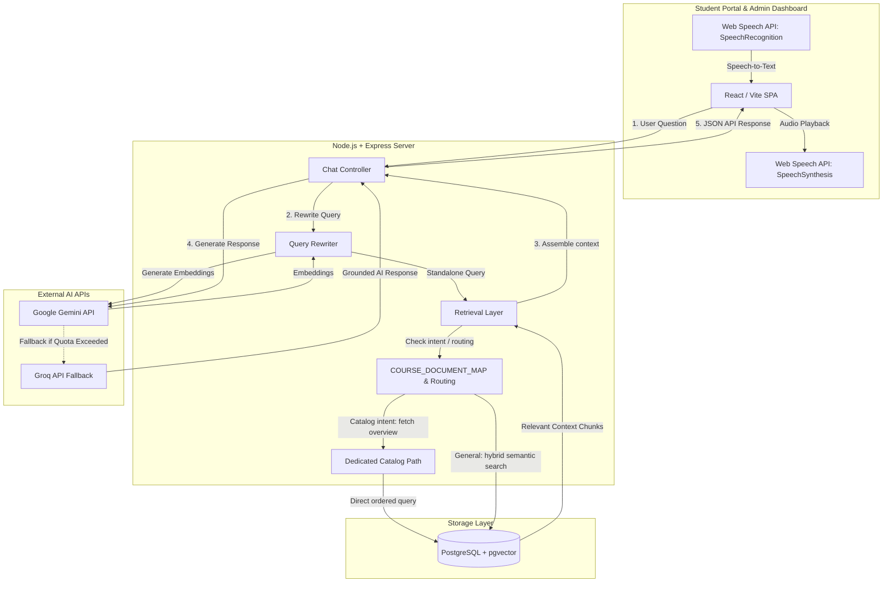
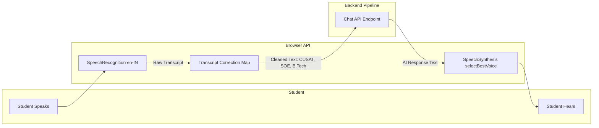

# AdmissionAI – AI-Powered University Admission Counselor

AdmissionAI is a portfolio-ready, full-stack Retrieval-Augmented Generation (RAG) platform designed to automate and streamline student admission enquiries. The system acts as a virtual counselor, providing instant, highly accurate, and voice-enabled responses regarding courses, fees, eligibility criteria, hostel facilities, scholarships, and general campus life based on verified university knowledge documents.

---

## Overview

AdmissionAI helps universities digitize and scale their student helpdesk operations. By combining modern AI models, advanced document retrieval strategies, and hands-free voice interactions, the platform automates repetitive administrative workflows while capturing qualified leads for human advisors.

Key capabilities of the platform include:
*   💬 **AI Chat Assistant:** Context-aware conversations with memory and query rewriting.
*   🎙️ **Voice Admission Counselor:** Hands-free, continuous conversational loop with natural speech synthesis.
*   📚 **Knowledge Base Management:** End-to-end PDF/text document ingestion, chunking, and indexing.
*   🔍 **Advanced Retrieval System:** Hybrid keyword/semantic vector search with specialized routing.
*   💼 **Lead Capture & Management:** Automatic registration and tracking of student prospective enquiries.
*   📊 **Analytics Dashboard:** Visualization of student engagement metrics, query volume, and hot topics.
*   📋 **Conversation History:** Detailed logs of student queries and AI-assisted responses.

---

## Key Features

### AI Admission Chatbot
*   **Context-Aware Memory:** Retains conversation context for follow-up questions.
*   **Conversation-Aware Query Rewriting:** Rewrites ambiguous statements (e.g. *"What are its placements?"*) into self-contained search terms using history.
*   **Source-Grounded Answers:** Restricts responses strictly to uploaded institutional documents to minimize hallucinations.

### Voice Admission Counselor
*   **Speech-to-Text (STT):** Leverages the browser Web Speech API for real-time speech transcription.
*   **Indian English Support (`en-IN`):** Optimized locale settings to accurately capture Indian English accents and names.
*   **Text-to-Speech (TTS):** Plays responses aloud using custom synthesis parameter configurations (friendly, conversational pace and tone).
*   **Continuous Voice Mode:** A hands-free conversational loop similar to ChatGPT Voice Mode.
*   **Voice Interruption (Barge-In):** Immediate playback cancellation when the student interrupts or clicks the screen, returning instantly to listening mode.
*   **Phonetic Transcript Correction:** Configurable mapping layer that corrects university-specific phonetic errors (e.g. *"pusad"* corrected to *"CUSAT"*, *"soy"* corrected to *"SOE"*).
*   **Silence & Idle State Management:** Smart feedback indicators (e.g., *"I'm listening..."* at 10s, *"Still listening..."* at 30s, and automatic pause at 60s).

### Knowledge Base Management
*   **Automated Ingestion Pipeline:** Extracts text, chunks paragraphs, and generates embeddings automatically upon upload.
*   **Embedding Generator:** Integrates with Gemini API to embed chunks into a vector space.
*   **Database Management:** Tracks chunk size, status, and indexing statistics on the Admin Dashboard.

### Advanced Retrieval System
*   **Hybrid Search:** Combines semantic search (vector cosine similarity) and exact keyword search (TF-IDF scoring).
*   **Course-Aware Routing:** Centralized document keyword map (`COURSE_DOCUMENT_MAP`) to instantly direct queries to relevant course files.
*   **Dedicated Catalog Retrieval Path:** Recognizes catalog-intent queries and retrieves all chunks of `courses_overview.txt` in narrative order, bypassing vector noise.
*   **Round-Robin Diversity:** Excludes unrelated course documents to make room for supporting files (fees, hostels, scholarships).

### Lead Management & Analytics
*   **Lead Identification:** Collects student contact information and course interests.
*   **Dashboard Visualizations:** Tracks session counts, lead capture rates, and popular queries using interactive charts.

---

## System Architecture



### Voice Interaction Flow


---

## RAG Architecture Pipeline

1.  **Student Query:** Student types or speaks a question.
2.  **Query Rewriting:** The chat controller analyzes historical context and rewrites pronoun-heavy follow-up questions into standalone queries.
3.  **Catalog-Intent Routing:** If the query asks for broad listings (e.g. *"Show all courses"*), it invokes a **Dedicated Catalog Path** that retrieves the full `courses_overview.txt` document in order.
4.  **Hybrid Retrieval:** Otherwise, it queries the PostgreSQL database by combining Gemini vector embeddings (via pgvector cosine distance) with a localized TF-IDF score.
5.  **Context Assembly:** Ranks the top chunks, applies document filtering to exclude competing disciplines, and merges them up to the character limit budget (up to 8000 characters for catalogs).
6.  **LLM Generation:** Sends the context to Gemini 2.5 Flash (falling back automatically to Groq Llama 3.3 if Gemini quota is exceeded) to formulate a grounded response.

---

## Recent Major Improvements

### 1. Robust Embedding System
*   Backfilled embeddings for all historical document chunks.
*   Updated the document upload endpoint to run a resilient, chunked embedding generator with exponential backoff retries, maintaining 100% embedding coverage.

### 2. Conversational Query Rewriting
*   Implemented a query rewriting layer that resolves pronouns using history.
*   Enforced standard format query mapping for specific entities (e.g., MCA, B.Tech IT).

### 3. Course Retrieval Routing
*   Replaced hardcoded check lists with a scalable `COURSE_DOCUMENT_MAP`.
*   Prioritizes up to 4 chunks from the target course document and isolates the search from other branch files to keep the context noise-free.

### 4. Dedicated Catalog Path
*   Configured regex-based catalog intent filters.
*   Sets up a dedicated database path to fetch the entire `courses_overview.txt` in index order.
*   Expanded the context budget limit dynamically to 8000 characters for catalog requests.

### 5. Voice counselor Upgrades
*   Configured continuous voice dialogue mode with automatic microphone re-activation.
*   Added automatic female-priority English voice selection (`Google UK English Female`, `Microsoft Zira`, etc.).
*   Developed a line-by-line Markdown parsing cleaner to translate bullet lists, headers, and emphasis tags into natural speech strings.

---

## Technology Stack

*   **Frontend:** React (SPA), TypeScript, Vite, Tailwind CSS, Shadcn UI
*   **Backend:** Node.js, Express.js, TypeScript
*   **Database:** PostgreSQL, Supabase, pgvector
*   **ORM:** Prisma
*   **AI Models & APIs:** Google Gemini 2.5 Flash, Gemini Embeddings, Groq (Llama-3.3-70b-versatile fallback)
*   **Deployment:** Vercel (Frontend), Render (Backend), Supabase (Database)

---

## Project Structure

```text
admission-ai-v2/
├── backend/                       # Express Backend Server
│   ├── prisma/                    # Prisma DB schema & migrations
│   │   └── schema.prisma          
│   ├── src/                       # Source code
│   │   ├── config/                # Database & ENV configuration
│   │   ├── controllers/           # Route handler controllers (chat, leads, docs)
│   │   ├── middleware/            # JWT Auth, request parsers
│   │   ├── routes/                # Express API endpoints definition
│   │   ├── services/              # AI Core logic (retrieval, vector search, llm, groq)
│   │   ├── utils/                 # Response formatters
│   │   └── scripts/               # Diagnostics & backfill utilities
│   ├── package.json
│   └── tsconfig.json
│
├── src/                           # React Frontend Application
│   ├── api/                       # API integration services (Axios client)
│   ├── components/                # Shared UI layouts (soundwaves, mic indicators)
│   ├── contexts/                  # Auth and Chat State providers
│   ├── hooks/                     # Custom React hooks
│   ├── pages/                     # Routed views (StudentPortal, AdminDashboard, Leads)
│   ├── types/                     # TypeScript definitions
│   ├── App.tsx                    # React routing entry point
│   ├── main.tsx                   # DOM attachment
│   └── index.css                  # Custom Tailwind & voice mode keyframe animation styles
│
├── package.json                   # Root package definitions
├── tailwind.config.js             # Tailwind design styles
└── vite.config.ts                 # SPA compiler config
```

---

## Screenshots

*Note: Below are visual placeholders for key segments of the application.*

*   **Student Portal Interface:** `[Placeholder: Student chat workspace with RAG answers]`
*   **Voice Counselor Modal:** `[Placeholder: Hands-free voice overlay with bouncing soundwave animations]`
*   **Admin Dashboard:** `[Placeholder: Knowledge base statistics and document list]`
*   **Leads Management Panel:** `[Placeholder: Student lead records, courses, and session logs]`
*   **Analytics Overview:** `[Placeholder: Student interaction query charts and key stats]`

---

## Future Enhancements

*   🌐 **Multi-Language Support:** Expand the voice counselor input to detect regional Indian languages (Hindi, Malayalam, Tamil) using whisper models.
*   💬 **WhatsApp Channel Integration:** Expose the RAG chatbot to WhatsApp to allow students to query admission updates via SMS.
*   📞 **Voice Calling Agent:** Integrate Twilio/Vapi to allow students to call the AI counselor directly via telephone.
*   🔌 **CRM Integrations:** Auto-sync captured student leads to institutional CRMs (like Salesforce or Zoho CRM).

---

## Skills Demonstrated

*   **RAG Architecture:** Design and deployment of hybrid lexical (TF-IDF) & semantic (pgvector) indexers.
*   **Voice Interface Engineering:** Implement hands-free browser loops, self-echo gating, speech-synthesis filters, and phonetic correction.
*   **Database Design:** Manage transactional data alongside vector spaces using PostgreSQL, Supabase, and Prisma.
*   **API Design:** Build scalable authentication, file uploads, and stream-ready endpoints in Node.js.
*   **DevOps & Error Handling:** Implement resilient external API rate limit fallbacks (Gemini ➔ Groq).

---

## Local Installation & Setup

### Clone the Repository
```bash
git clone https://github.com/your-username/admission-ai-v2.git
cd admission-ai-v2
```

### Backend Installation
1. Navigate to the backend folder:
   ```bash
   cd backend
   ```
2. Install packages:
   ```bash
   npm install
   ```
3. Set up your `.env` file in the `backend/` directory:
   ```env
   PORT=5000
   DATABASE_URL="postgresql://<username>:<password>@<host>:<port>/<dbname>?pgconnector=true"
   DIRECT_URL="postgresql://<username>:<password>@<host>:<port>/<dbname>"
   GEMINI_API_KEY="your-google-gemini-api-key"
   GEMINI_MODEL="gemini-2.5-flash"
   GROQ_API_KEY="your-groq-api-key"
   GROQ_MODEL="llama-3.3-70b-versatile"
   JWT_SECRET="your-jwt-auth-secret-key"
   RETRIEVAL_SCORE_THRESHOLD=0.20
   MAX_CHUNKS_PER_DOC=4
   ```
4. Setup database schemas:
   ```bash
   npx prisma generate
   npx prisma db push
   ```
5. Run the server:
   ```bash
   npm run dev
   ```

### Frontend Installation
1. Navigate back to the root folder (where the frontend files reside):
   ```bash
   cd ..
   ```
2. Install packages:
   ```bash
   npm install
   ```
3. Run the development build:
   ```bash
   npm run dev
   ```
4. Access the Student Portal in your browser at `http://localhost:5173`.
