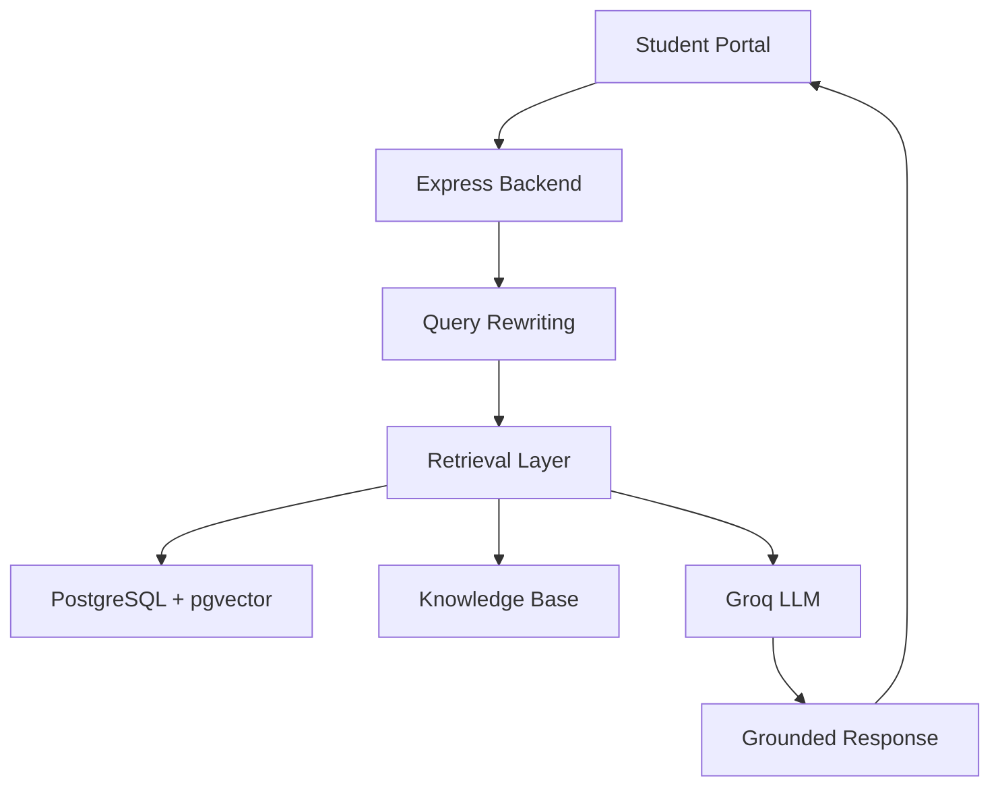
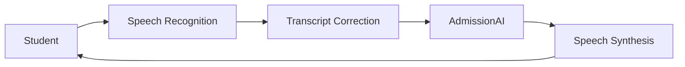

# AdmissionAI – AI-Powered University Admission & Student Engagement Platform

AdmissionAI is a full-stack AI-powered admission assistance platform that helps universities automate student enquiries through intelligent chat, voice conversations, retrieval-augmented generation (RAG), and lead management.

The platform acts as a virtual admission counselor capable of answering questions about courses, eligibility, fees, scholarships, hostels, placements, and campus life using information retrieved from a university knowledge base.

---

## Overview

Universities receive thousands of repetitive admission-related enquiries every year. AdmissionAI reduces the workload of admission offices by providing instant, context-aware, and voice-enabled assistance to prospective students.

The platform combines:

* AI Chat Assistant
* Voice Admission Counselor
* Retrieval-Augmented Generation (RAG)
* Knowledge Base Management
* Lead Capture & Tracking
* Analytics Dashboard
* Conversation History Management

---

## Key Features

### AI Admission Chatbot

* Context-aware conversations
* Follow-up question understanding
* Conversation-aware query rewriting
* Retrieval-Augmented Generation (RAG)
* Knowledge-grounded responses
* Reduced hallucinations through document-based retrieval

### Voice Admission Counselor

* Speech-to-Text using Web Speech API
* Text-to-Speech responses
* Continuous Voice Conversation Mode
* Hands-free conversational experience
* Indian English speech recognition (`en-IN`)
* Transcript correction for university-specific terminology
* Automatic voice replay, mute, and stop controls
* Female-priority voice selection for natural responses

### Knowledge Base Management

* Upload university documents
* Automated text extraction
* Intelligent document chunking
* Automatic embedding generation
* Vector indexing
* Semantic search support

### Advanced Retrieval System

* Hybrid Retrieval (Semantic + Keyword Search)
* Course-aware document routing
* Conversation-aware query rewriting
* Catalog intent detection
* Context optimization
* Retrieval diagnostics
* Course-specific document prioritization

### Lead Management

* Student enquiry tracking
* Lead capture forms
* Lead lifecycle management
* Conversation-linked leads

### Analytics Dashboard

* Student engagement metrics
* Query trends
* Lead statistics
* Usage analytics

---

## RAG Pipeline

```text
Student Query
        ↓
Query Rewriting
        ↓
Intent Detection
        ↓
Hybrid Retrieval
   (Semantic + Keyword)
        ↓
Context Assembly
        ↓
LLM Generation
        ↓
Grounded AI Response
```

### Retrieval Features

* Vector Search using pgvector
* Semantic Similarity Search
* Hybrid Ranking
* Course-Aware Routing
* Catalog Query Optimization
* Conversation Context Preservation

---

## Voice AI Architecture

```text
Student Speech
        ↓
Speech Recognition
        ↓
Transcript Correction
        ↓
AdmissionAI Chat Pipeline
        ↓
RAG Retrieval
        ↓
AI Response
        ↓
Speech Synthesis
        ↓
Audio Response
```

### Voice Features

* Continuous listening mode
* Automatic response playback
* Voice interruption handling
* Silence timeout recovery
* Transcript correction engine
* Natural conversational flow

---

## Major Enhancements Implemented

### Embedding System

* Backfilled embeddings for all knowledge base documents
* Automatic embedding generation during uploads
* Complete embedding coverage across indexed documents

### Conversation-Aware Query Rewriting

Examples:

```text
User:
Tell me about B.Tech CSE

User:
What are the placements?

Rewritten Query:
B.Tech CSE placements
```

### Course Retrieval Optimization

* COURSE_DOCUMENT_MAP implementation
* Course synonym expansion
* Adaptive course routing
* Noise reduction from unrelated documents

### Catalog Query Optimization

Examples:

```text
What courses are available?
List all courses offered by CUSAT
Show available programs
```

These queries trigger dedicated catalog retrieval paths to provide complete program listings.

### Voice Counselor Enhancements

* Continuous Voice Conversation Mode
* Improved speech quality
* Female-priority voice selection
* Transcript correction layer
* Indian English speech recognition optimization

---

## Technology Stack

### Frontend

* React
* TypeScript
* Vite
* Tailwind CSS
* Shadcn UI

### Backend

* Node.js
* Express.js
* TypeScript

### Database

* PostgreSQL
* Supabase
* pgvector

### ORM

* Prisma

### AI & RAG

* Groq
* Google Gemini Embeddings
* Vector Search
* Retrieval-Augmented Generation (RAG)

### Deployment

* Vercel
* Render
* Supabase

---

## System Architecture



### Voice Layer



---

## Project Structure

```text
admission-ai-v2/

├── backend/
│   ├── prisma/
│   ├── src/
│   │   ├── config/
│   │   ├── controllers/
│   │   ├── middleware/
│   │   ├── routes/
│   │   ├── services/
│   │   ├── scripts/
│   │   └── utils/
│   └── package.json
│
├── src/
│   ├── components/
│   ├── contexts/
│   ├── hooks/
│   ├── pages/
│   ├── api/
│   ├── types/
│   └── App.tsx
│
├── package.json
├── vite.config.ts
└── README.md
```

---

## Screenshots

### Student Portal

<<<<<<< HEAD


=======


>>>>>>> ab72b12 (Added SS to Readme)

### Admin Dashboard


---

## Future Enhancements

* Multi-language support
* WhatsApp integration
* AI phone-call admission counselor
* Advanced analytics and reporting
* University CRM integrations
* Multi-university support

---

## Skills Demonstrated

### AI & Machine Learning

* Retrieval-Augmented Generation (RAG)
* Semantic Search
* Vector Databases
* Embedding Generation
* Prompt Engineering

### Full Stack Development

* React
* TypeScript
* Express.js
* Node.js
* REST APIs

### Database Engineering

* PostgreSQL
* Supabase
* Prisma ORM
* pgvector

### Voice AI

* Speech Recognition
* Speech Synthesis
* Conversational AI
* Voice UX Design

### Software Engineering

* System Design
* API Development
* Database Design
* Error Handling
* Performance Optimization
* Deployment & DevOps

---

## Impact

AdmissionAI demonstrates how modern AI, vector search, and voice technologies can be combined to create a scalable digital admission counselor capable of providing accurate, context-aware, and conversational assistance to prospective university students.
